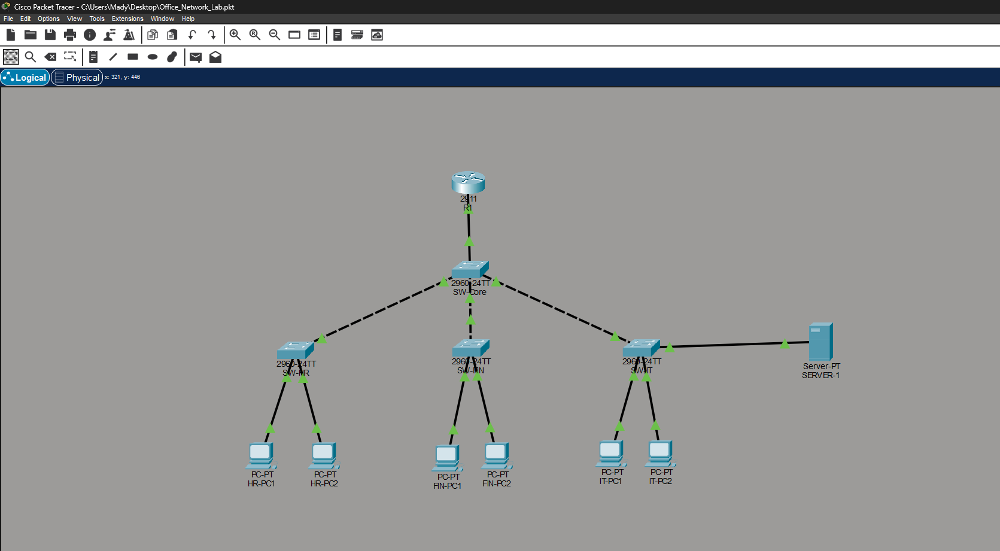
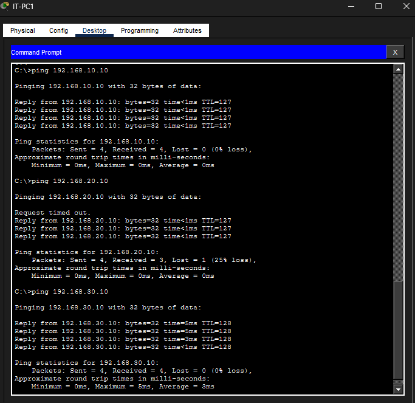
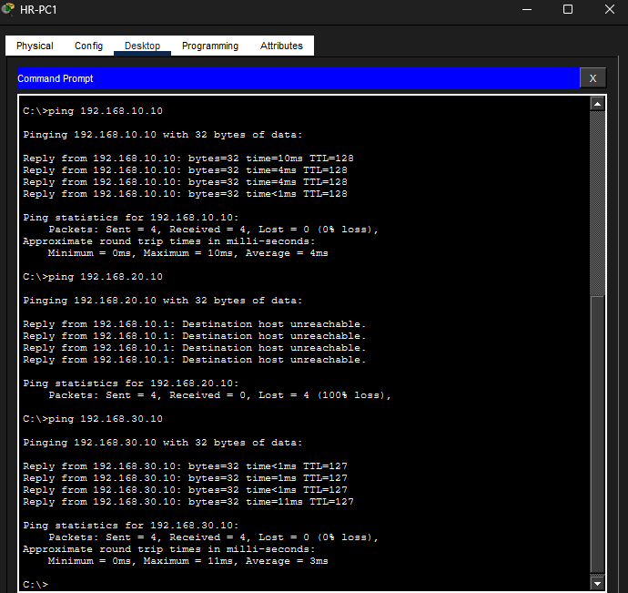
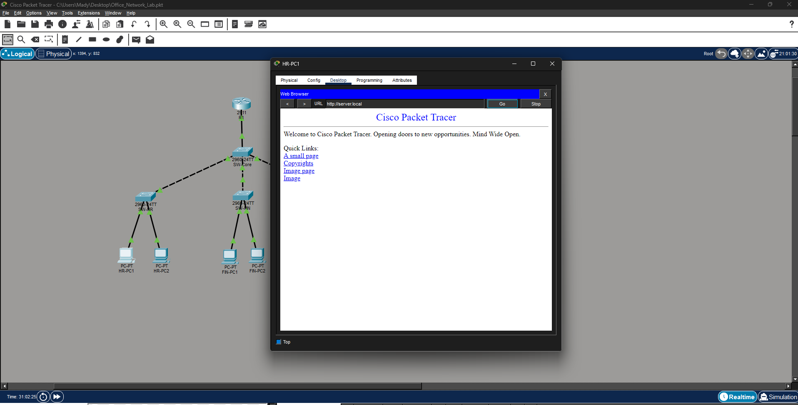

# Cisco Packet Tracer - Small Office Network Lab

## Overview
Designed and simulated a multi-department office network for HR, Finance, 
and IT using Cisco Packet Tracer. The project covers VLANs, inter-VLAN 
routing, DHCP, DNS, and ACL-based security.

## Tools Used
* Cisco Packet Tracer
* Cisco 2911 Router
* Cisco 2960 Switches x4

## Network Topology

## Test Results

## IP Addressing Table
| Device   | VLAN | IP Address      | Gateway       |
|----------|------|-----------------|---------------|
| HR-PC1   | 10   | 192.168.10.10   | 192.168.10.1  |
| HR-PC2   | 10   | 192.168.10.11   | 192.168.10.1  |
| FIN-PC1  | 20   | 192.168.20.10   | 192.168.20.1  |
| FIN-PC2  | 20   | 192.168.20.11   | 192.168.20.1  |
| IT-PC1   | 30   | 192.168.30.10   | 192.168.30.1  |
| IT-PC2   | 30   | 192.168.30.11   | 192.168.30.1  |
| SERVER-1 | 30   | 192.168.30.5    | 192.168.30.1  |

## What I Configured
* VLANs 10, 20, 30 for department segmentation
* Trunk links between switches using 802.1Q
* Inter-VLAN routing using Router-on-a-Stick
* Centralised DHCP server with 3 pools
* DNS resolving server.local to 192.168.30.5
* ACLs blocking HR from accessing Finance and vice versa

## Tests Performed
* IT-PC1 successfully pinged Finance ✅
* HR-PC1 ping to Finance timed out (ACL working) ✅
* server.local resolved and loaded via web browser ✅

## What I Learned
I can now confidently troubleshoot Layer 2 and Layer 3 network issues, 
explain IP addressing and subnetting, and understand what happens behind 
the scenes when a helpdesk ticket comes in about network access. This project 
bridges the gap between my real-world helpdesk experience and the networking 
fundamentals that make me a stronger IT support professional.
